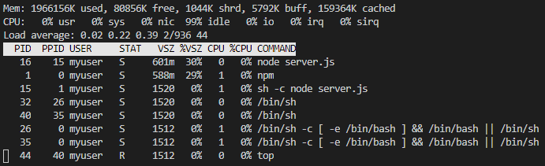
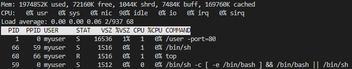

Docker가 무엇이고, 어떻게 사용하는지 파악하는 가장 좋은 방법은 아무래도 직접 사용해보는 것일 것이다. 이를 위해서 microservice로 이루어진 [Sock Shop](https://microservices-demo.github.io/)을 container 단위로 분해해서 공부를 해보자.

# Sock Shop
Sock Shop은 Weaveworks에서 만든 **microservice demo application**으로, microservice의 demostration과 testing, 그리고 cloud native technology를 위해서 만들었다.

[Weaveworks](https://www.weave.works/)와 [Container Solution](https://www.container-solutions.com/)에 의해서 유지되고 관리받고 있다.

[Please see the official document for more information](https://microservices-demo.github.io/)

# Basic Architecture
기본적인 Architecture는 다음과 같다.

그림과 같이 front-end에서 여러 API를 통해서 다른 Microservice와 통신을 하는 구조이다.

추가적으로 공부할 것:
 * Microservice끼리 구체적으로 어떻게 통신하는지,
 * 나중에 edge computing을 적용한다고 했을 때, 이를 어떻게 적용할지
    * Edge Computing을 위해서는 좀 땡겨와야 하는 것들이 있다. Microservice의 어디까지를 땡겨야 할지를 생각해야한다.

## Calling Microservice
위 architecture에 따르면, front-end에서 API를 통해서 다른 Microservice를 부르게 된다.

front-end에서 돌아가는 task를 보면 다음과 같음을 알 수 있다.


### front-end to user(user-db)
front-end의 Dockerfile을 보자.
``` Dockerfile
FROM node:4-alpine
ENV NODE_ENV "production"
ENV PORT 8079
EXPOSE 8079
RUN addgroup mygroup && adduser -D -G mygroup myuser && mkdir -p /usr/src/app && chown -R myuser /usr/src/app

# Prepare app directory
WORKDIR /usr/src/app
COPY package.json /usr/src/app/
COPY yarn.lock /usr/src/app/
RUN chown myuser /usr/src/app/yarn.lock

USER myuser
RUN yarn install

COPY . /usr/src/app

# Start the app
CMD ["/usr/local/bin/npm", "start"]
```
다음과 같이 /usr/local/bin/npm을 실행함을 알 수 있다.


`/usr/src/app/public/js`에 있는 client.js를 보면 그냥 단순하게 ajax call을 사용한다.
``` js
function login() {
    var username = $('#username-modal').val();
    var password = $('#password-modal').val();
    $.ajax({
        url: "login",
        type: "GET",
        async: false,
        success: function (data, textStatus, jqXHR) {
            $("#login-message").html('<div class="alert alert-success">Login successful.</div>');
            console.log('posted: ' + textStatus);
            console.log("logged_in cookie: " + $.cookie('logged_in'));
            setTimeout(function(){
                location.reload();
            }, 1500);
        },
        error: function (jqXHR, textStatus, errorThrown) {
            $("#login-message").html('<div class="alert alert-danger">Invalid login credentials.</div>');
            console.log('error: ' + JSON.stringify(jqXHR));
            console.log('error: ' + textStatus);
            console.log('error: ' + errorThrown);
        },
        beforeSend: function (xhr) {
            xhr.setRequestHeader("Authorization", "Basic " + btoa(username + ":" + password));
        }
    });
    return false;
}

function register() {
    var username = $('#register-username-modal').val();
    var email = $('#register-email-modal').val();
    var password = $('#register-password-modal').val();
    var firstName = $('#register-first-modal').val();
    var lastName = $('#register-last-modal').val();
    var postvals = JSON.stringify({
                "username": username,
                "password": password,
                "email": email,
                "firstName": firstName,
                "lastName": lastName
        });
        console.log(postvals);
    $.ajax({
        url: "register",
        type: "POST",
        async: false,
        data: postvals,
        success: function (data, textStatus, jqXHR) {
            $("#registration-message").html('<div class="alert alert-success">Registration and login successful.</div>');
            console.log('posted: ' + textStatus);
            console.log("logged_in cookie: " + $.cookie('logged_in'));
            setTimeout(function(){
                location.reload();
            }, 1500);
        },
        error: function (jqXHR, textStatus, errorThrown) {
            $("#registration-message").html('<div class="alert alert-danger">There was a problem with your registration: ' + errorThrown + '</div>');
            console.log('error: ' + JSON.stringify(jqXHR));
            console.log('error: ' + textStatus);
            console.log('error: ' + errorThrown);
        },
    });
    return false;
}

function logout() {
    $.removeCookie('logged_in');
    location.reload();
}
```
user container를 봤는데, 일단 top을 쓰니 다음과 같다.

근데 /user가 permission denied로 안들어가진다.
`sudo` command도 없다.
어떻게 해야하지?


# Memo
 * API의 경우에는 다들 Javascript로 호출하는 식으로 되어 있었다.
   * 내부에 go로 되어있는 건 못봤는데 이미 바이너리로 빌드한 채로 올려져 있는 건가?
도커 시작:
``` bash
docker-compose -f deploy/docker-compose/docker-compose.yml up -d
```
도커 종료:
``` bash
docker stop $(docker ps -a -q)
```

# Todo
READ_ONLY를 가정하자.
## Sock Shop의 여러 service들을 container로 여러 개로 구축
[Sock Shop](https://microservices-demo.github.io/)
microservice로 이루어짐 - 구축 해보기
 * 구축할 때, server에다가 구축하기 - 나중에 영진이형이 접근할 수 있게

## service discovery
Sock Shop에서 service discovery를 어떻게 하는지 알아보자.
 - 원래 architecture는 다 클라우드에 있음
 - 이를 edge단으로 땡겨야 할까?
사용자 요청 - API gate
얘를 찾아내서

Netflix - Eureka